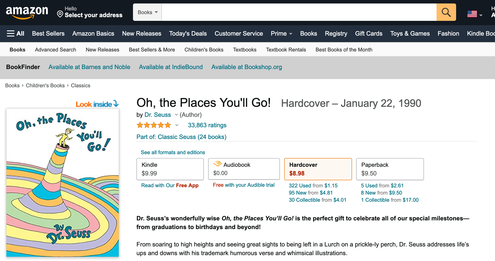

<!--
SPDX-FileCopyrightText: 2022 Greg Back <git@gregback.net>
SPDX-License-Identifier: CC-BY-SA-4.0
-->
# bookfinder

Web Extension to add links to other bookstores on Amazon product pages.

Amazon is by far the most popular way people share links to books. This
extension makes it easy to go from books on Amazon to the same book on other sites. Currently supported sites are:

- [Barnes and Noble](https://www.barnesandnoble.com/)
- [IndieBound](https://www.indiebound.org/)
- [Bookshop.org](https://bookshop.org/)
- [Booksio](https://www.booksio.com/)

NOTE: This only works for Amazon's US domains for now.

**Screenshot**:



(*from [this page](https://www.amazon.com/Oh-Places-Youll-Dr-Seuss/dp/0679805273)*).

## Installation

[Install] from `addons.mozilla.org`.

[Install]: https://addons.mozilla.org/en-US/firefox/addon/bookfinder/

## Developing

Use the [`web-ext`](https://github.com/mozilla/web-ext) tool to develop, test,
and build this extension.

```sh
npm install -g web-ext

web-ext run

web-ext lint

web-ext build --ignore-files "*.png"
```

For now I've been manually uploading the extension to `addons.mozilla.org`
rather than trying to set up `web-ext sign`.
